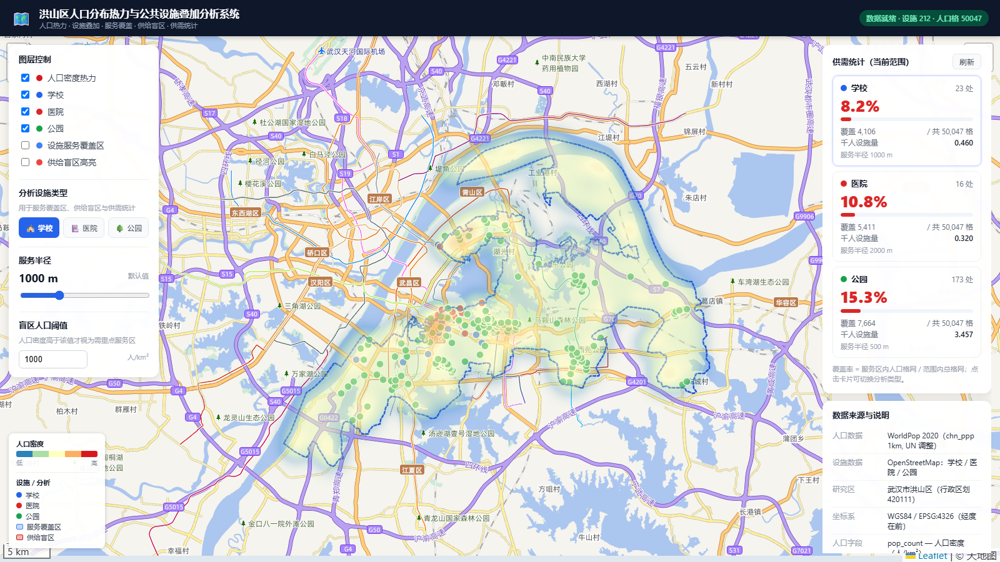

# 洪山区人口分布热力与公共设施叠加分析系统

> 选题 T8：「人口分布热力与公共设施叠加」。以**武汉市洪山区**为研究区，叠合人口栅格与公共设施（学校 / 医院 / 公园），用热力图与图层叠加呈现"人在何处、设施是否充足"，并识别**供给盲区**。



---

## 项目概览

**前后端分离** 的 GIS 可视化项目：

- **前端**：Vue 3 + Vite + Leaflet + leaflet.heat
- **后端**：FastAPI + Uvicorn（默认文件后端，shapely + numpy，无需数据库）
- **数据**：WorldPop 2020 人口栅格、OpenStreetMap 设施点、洪山区边界
- **坐标系**：全链路 WGS84 / EPSG:4326，经度在前

前端负责地图交互、图层切换、热力渲染和结果面板；后端负责空间查询、缓冲覆盖、盲区识别和统计接口。

---

## 功能

| 编号 | 功能 | 说明 |
| --- | --- | --- |
| F1 | 底图加载与地图浏览 | 天地图（矢量/影像），自动定位洪山区并绘制边界 |
| F2 | 人口分布可视化 | WorldPop 2020 栅格 → 约 100m 网格 → 格心点，Leaflet.heat 热力渲染 |
| F3 | 公共设施图层叠加 | 学校 / 医院 / 公园分色点位叠加 |
| F4 | 设施分类筛选 | 图层面板按类型独立开关 |
| F5 | 点选查询 | 点击设施 / 盲区查看属性 |
| F6 | 设施服务范围展示 | 按类型默认半径（学校 1000m / 医院 2000m / 公园 500m）的缓冲服务区，可调 |
| F7 | 供给盲区识别 | 高人口密度且未被服务区覆盖的区域高亮展示 |
| F8 | 供需指标面板 | 选中设施类型的覆盖率、覆盖/未覆盖人口；选"全部"时显示合并统计 |
| F9 | 后端统计接口 | FastAPI 提供 9 个空间分析接口 |
| F10 | 数据状态自检 | 启动时检测本地数据是否齐全，避免空白页 |
| F11 | 云端部署 | `docker compose` 一键起前后端 |
| F12 | 人口密度点查询 | 点击地图任意位置，弹窗显示该点人口密度（人/km²） |

---

## 界面布局

```
┌──────────────────┬──────────────────────────┐
│     顶栏标题（42px）       [数据就绪状态]      │
├──────────────────┼──────────────────────────┤
│ [👁图层][📊分析]  │                          │
│                  │       地图（全幅）         │
│ □ 人口密度热力    │      🖱 十字光标          │
│ □ 学校 □ 医院    │                          │
│ □ 公园           │    🗺 图例（左下角）       │
│ □ 服务覆盖区      │                          │
│ □ 供给盲区        │                          │
│                  │                          │
├──────────────────┤                          │
│ ■ 学校 78.3% [▾] │                          │
│ ████████░░░░░░   │                          │
│ 覆盖 12,345 格    │                          │
├──────────────────┤                          │
│ 🖱 点击地图查人口  │                          │
└──────────────────┴──────────────────────────┘
```

左侧面板分两个 Tab——「图层」控制显示内容，「分析」配置设施类型、服务半径和盲区阈值。底部供需统计始终可见，可折叠展开查看详情。

---

## 常用命令

### 一键启动（推荐）

在**项目根目录**执行：

```bash
npm start
```

首次运行前安装依赖：

```bash
npm run setup
```

启动后访问：前端 <http://localhost:5173>，后端文档 <http://localhost:8000/docs>

### 单独启动

```bash
npm run backend    # 仅后端
npm run frontend   # 仅前端
npm run build      # 构建前端
```

### Docker 部署

```bash
docker compose up --build
```

- 前端：<http://localhost:8080>
- 后端文档：<http://localhost:8000/docs>

---

## 后端 API

Base URL：`/api/v1`

| 方法 | 路径 | 功能 |
| --- | --- | --- |
| GET | `/population/heatmap` | 人口密度热力点（`bbox`,`zoom`,`dataset`） |
| GET | `/population/at-point` | 点查询人口密度（`lng`,`lat`） |
| GET | `/facilities` | 设施分页列表（`bbox`,`facility_type`,`page`,`page_size`） |
| GET | `/analysis/supply-demand` | 覆盖率 + 千人设施量（单类型） |
| GET | `/analysis/supply-demand-all` | 覆盖率 + 千人设施量（全类型合并） |
| GET | `/analysis/blind-spots` | 供给盲区 GeoJSON（单类型） |
| GET | `/analysis/blind-spots-all` | 供给盲区 GeoJSON（全类型） |
| GET | `/analysis/coverage` | 设施缓冲覆盖区 GeoJSON（单类型） |
| GET | `/analysis/coverage-all` | 设施缓冲覆盖区 GeoJSON（全类型） |
| GET | `/meta/status` | 数据状态自检 |
| GET | `/meta/boundary` | 研究区边界 GeoJSON |

---

## 本地开发配置

### 前端环境变量 (`frontend/.env`)

- `VITE_TIANDITU_KEY`：天地图密钥（推荐配置）
- `VITE_BACKEND_ORIGIN`：远程后端地址（默认经 Vite 代理到本地 8000）

### 后端环境变量

- `DATA_BACKEND=geojson`：默认文件模式
- `DATA_BACKEND=postgis`：切换到 PostgreSQL + PostGIS
- `CORS_ORIGINS` / `DATA_DIR` 等

---

## 参考文档

| 文档 | 内容 |
| --- | --- |
| [docs/开发者文档.md](docs/开发者文档.md) | 架构、请求链路、文件索引 |
| [docs/后端文件说明.md](docs/后端文件说明.md) | 后端逐文件详解 |
| [docs/前端文件说明.md](docs/前端文件说明.md) | 前端逐文件详解 |
| [docs/api/接口契约.md](docs/api/接口契约.md) | 接口字段与契约 |

---

## 许可

代码 MIT License；第三方数据各自遵循其原始许可（WorldPop CC BY 4.0、OSM ODbL、天地图服务条款）。
